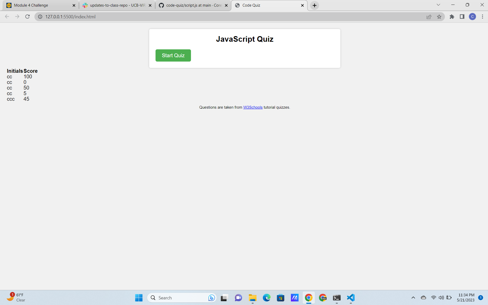
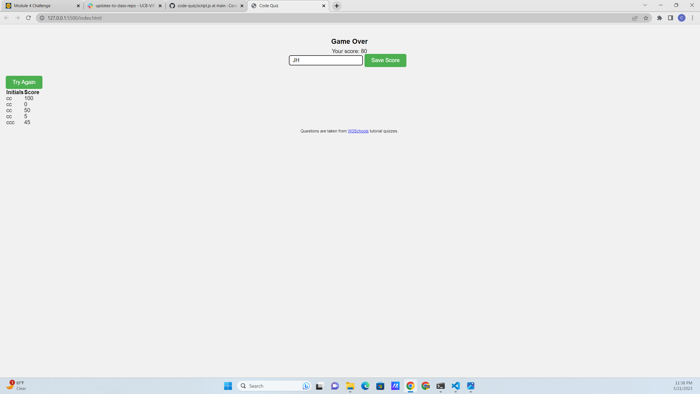

# Code Quiz

## A short quiz about basic web development. The quiz is timed and if you get questions wrong you will lose 5 seconds. You can save your scores as well. I made it to help myself study and will probably expand upon it in the future. I learned a lot about getting timers to work.

## No need to install anything, just hop on to the webpage.

## Using this app is very self-explanatory and simple. Simply open the app in a browser of your choice and hit start quiz. Try to select the correct answers because if you don't you'll get a 5 seond penalty.

## MIT License
